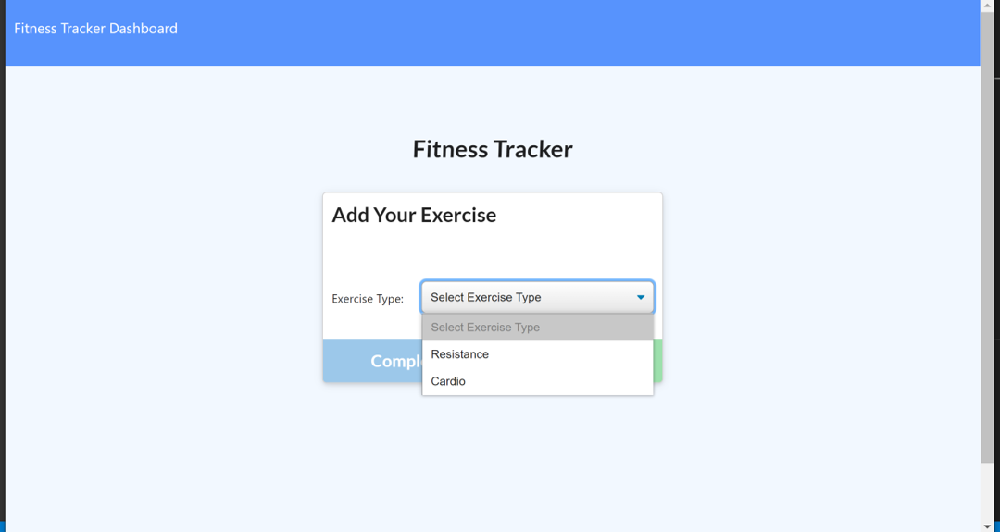

# Workout-Tracker
## Description
The Workout Tracker application provides the user with the ability to create and track daily workouts to reach a certain goal. 

Deployed application can be viewed through the following link: [Workout-Tracker](https://stormy-escarpment-39241.herokuapp.com/?id=60a564413b7e1600151330d6)

## Table of Contents

[Description](#Description)

[Technologies-&-tools-used](#Technologies-&-tools-used)

[Installation](#Installation)

[Usage](#usage)

[How-it-Works](#How-it-Works)

[License](#License)

[Badges](#Badges)

[Contributing](#contributing)

[Tests](#tests)

[Questions](#questions)

## Technologies & tools used
1. HTML
2. JavaScript
3. MongoDB
4. Dependencies
    * express
    * mongoose
    * morgan

## Installation
To install the application locally, follow the following steps:
1. Clone the repo on your local machine
3. Install the followning dependencies:
    * [express](https://www.npmjs.com/package/express) through `npm i express` command
    * [mongoose](https://www.npmjs.com/package/mongoose) thgouth `npm i mongoose` command
    * [morgan](https://www.npmjs.com/package/morgan) through `npm i morgan` command
4. Make sure that the MongoDB is running, through running the command `mongo` either on gitbash, command line or powershell
5. Seed the Database using the command `npm seed` or `node seeders/seed.js`
6. Run the local server using the command `npm start` or `node server.js`
7. To open the application locally, open localhost:3000 in your browser

## Usage
The Workout Tracker enables the user to track their daily exercises through adding different types of workouts and being able to track the overall progress through the dashboard providing the user with workout stats.

## How It Works
The Workout Tracker application is deployed on Heroku through the following link [Workout-Tracker](https://stormy-escarpment-39241.herokuapp.com/?id=60a564413b7e1600151330d6) while the database is setup on MondoDB Atlas.

Upon opening the deployed application the user is presented with the Homepage which enables the user to create a New Workout. 

**New Workout** 

Creating a New wWorkout presents the user with the option to add the type of exercise form a drop-down list, the list currently includes Resistance and Cardio.

1. **Resistance:** 
The Resistance exercises provides the user with an interface that includes a form to be filled out with the exercise details: 
* Exercise Type
* Name 
* Weight in lbs 
* Sets 
* Reps 
* Duration in minutes

2. **Cardio**
The Cardio exercise provides the user with an interface that includes a form to be filled out with the exercise details:
* Exercise Type
* Name
* Distance in miles
* Duration in minutes

Upon filling all the required excercise details, the user clicks on Add Exercise an quick pop-up message shall be displayed to confirm that the workout was added successfully and then the user clicks on Complete. 

Once the user is done adding the exercise, a page displaying the Last workout is rendered, presenting the Last Workout detail. This page provides the user with the option to either create a New Workout or Continue Workout.

## License

## Badges

## Contributing 

To contribute to this project, please make sure you follow the guidelines in [The Contributor Covenant](https://www.contributor-covenant.org/) as general guidelines.
Kindly maintain the highest ethics and respect. For further questions or requests kindly contact me through my [Email](mailto:noha_ashraf85@hotmail.com) or [GitHub](https://github.com/NohaAshraf85).

## Tests
The application has been tested on the browser and on multiple devices to test the responsiveness.

## Questions
For any questions, please contact me through [GitHub](https://github.com/NohaAshraf85) 
or [Email](mailto:noha_ashraf85@hotmail.com)